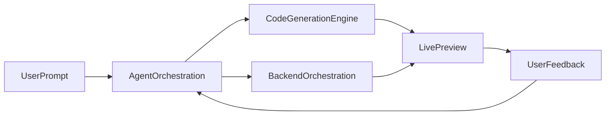
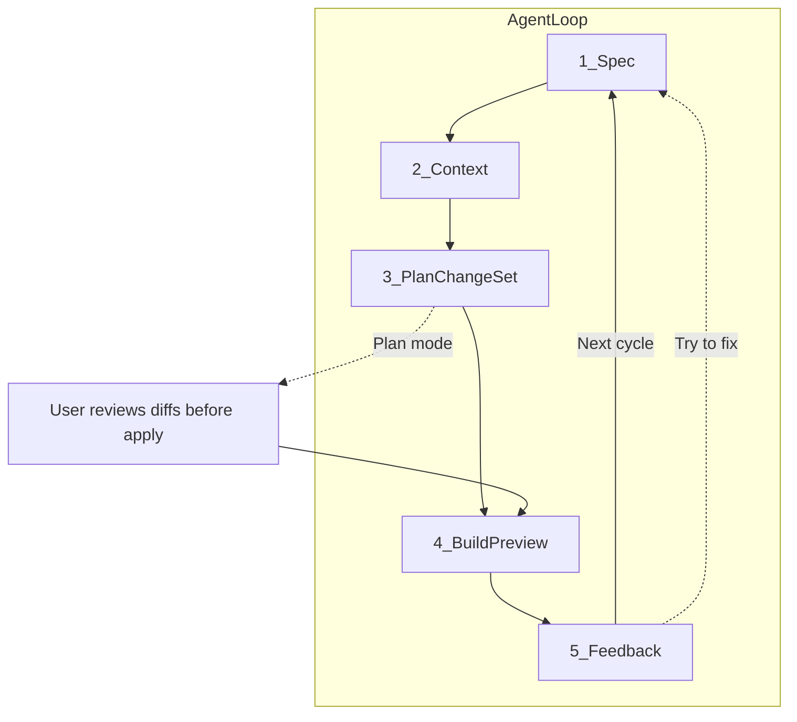
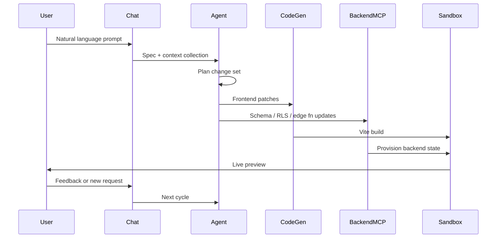
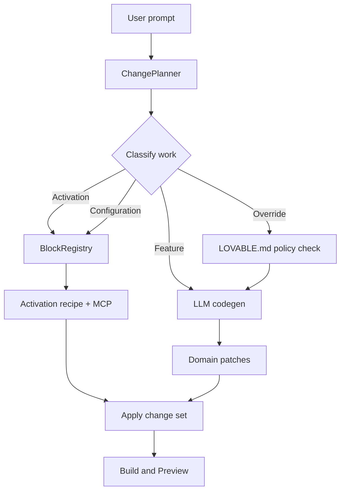
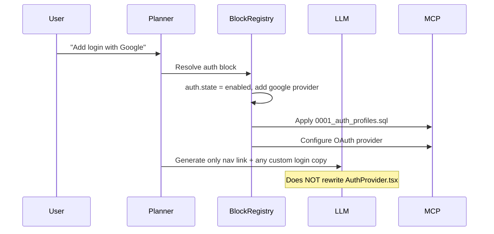
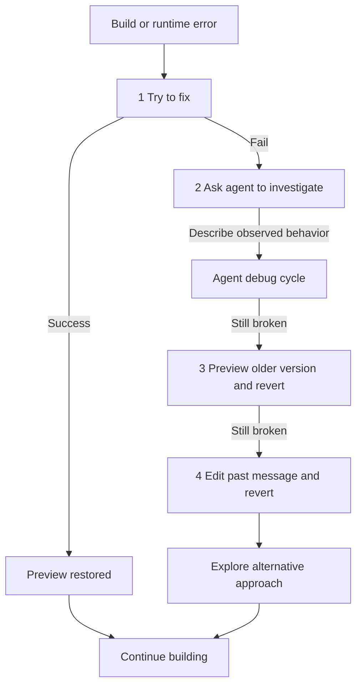

# Agent Loop & Orchestration

This document is the detailed reference for how Lovable's AI agent orchestrates intent → code → preview cycles. It covers the cognitive loop, generation modes, work classification against reusable blocks, and error recovery.

For the full platform stack and layer responsibilities, see [system-design.md](./system-design.md). For block contracts, activation recipes, and protected paths, see [reusable-blocks.md](./reusable-blocks.md).

---

## Overview

Lovable does not generate applications in a single shot. The **agent orchestration layer** runs a continuous loop: parse intent, gather context, plan a change set, build in an isolated sandbox, and incorporate feedback. Each cycle may touch frontend patches, backend schema, edge functions, and integrations — coordinated through the change planner and, when applicable, the block registry.



---

## Five-Step Iterative Loop

Every agent turn follows the same five phases. Feedback from step 5 starts the next cycle at step 1.

| Step | Name | Responsibility |
|------|------|----------------|
| 1 | **Spec** | Parse user intent, constraints, stack preferences, and scope boundaries |
| 2 | **Context** | Collect project file tree, env state, recent chat history, and prior diffs |
| 3 | **Plan / Change Set** | LLM produces a multi-file change plan (frontend patches, schema migrations, edge functions, integrations). **Plan mode** exposes diffs before apply |
| 4 | **Build & Preview** | Vite rebuild in an isolated sandbox; deploy artifact to the preview environment |
| 5 | **Feedback** | Runtime/build errors, user clarifications, or new requirements feed the next cycle; **Try to fix** attempts auto-resolution |



### Step details

**Spec** — The agent extracts what the user wants, what they explicitly do *not* want, and any stack or policy constraints from `LOVABLE.md`. Ambiguous scope is narrowed before planning.

**Context** — The context manager assembles a bounded snapshot: file tree, relevant open files, env validation state, recent messages, and the last applied change set. See [Bounded context](#bounded-context) below.

**Plan / Change Set** — The change planner classifies work (see [Work classification](#work-classification)) and either invokes deterministic block recipes or delegates domain code to the LLM. The output is a structured multi-file diff, not raw prose.

**Build & Preview** — Patches apply in a sandbox. TypeScript compile and Vite build must pass before the preview URL updates. Backend changes provision through MCP before the frontend can call new APIs.

**Feedback** — Build failures, runtime errors, MCP logs, and user messages re-enter the loop. The platform surfaces a **Try to fix** action for automatic retry; see [Error handling](#error-handling-strategy).

---

## Key Design Strategies

These constraints keep the loop reliable at scale.

### Incremental building

The platform encourages **small, scoped prompts** rather than monolithic requests. Large change sets increase context drift and merge conflict risk (especially when Code mode and chat are used together). Each cycle should target one feature, one block activation, or one bug fix.

### Sandboxed execution

Generated code runs in an **isolated preview environment** before the user sees it. Failed builds never replace a working preview artifact; the last good build remains addressable for revert.

### Validation harness

A **TypeScript compile + Vite build gate** blocks preview deployment when the change set is broken. The agent receives structured compiler and linter output on failure, which feeds the Try-to-fix path or the next manual prompt.

### Bounded context

The agent retains **recent messages only** — there is no infinite persistent memory across sessions. Users must re-state critical constraints (auth provider, naming conventions, business rules) when starting new threads or after long gaps. The context manager prioritizes files touched in recent diffs and manifest state over the full repo.

---

## Main Orchestration Sequence

End-to-end flow from user prompt to live preview, including frontend codegen and backend MCP provisioning.



| Participant | Role in the loop |
|-------------|------------------|
| **Chat** | Presentation layer; collects prompts, shows diffs (Plan mode), surfaces Try to fix and revert |
| **Agent** | Spec parsing, context assembly, change planning, orchestration of codegen and MCP |
| **CodeGen** | React/TanStack patches, Tailwind/shadcn styling, TypeScript compilation |
| **BackendMCP** | Bidirectional Supabase/Lovable Cloud access — migrations, RLS, secrets, logs, edge fn deploy |
| **Sandbox** | Isolated preview host; hot reload during active sessions |

---

## Generation Modes

Users interact with the platform through several modes. Each mode enters the agent loop at a different point but converges on the same build-and-preview pipeline.

| Mode | Behavior | Enters loop at |
|------|----------|----------------|
| **Chat mode** | Interactive multi-step reasoning, debugging, and planning | Spec → full loop |
| **Agent mode** | Autonomous exploration, proactive debugging, web search for solutions | Spec → full loop (higher autonomy budget) |
| **Visual Edits** | Client-side AST manipulation for inline text/color changes without full LLM regen (~40% faster UI iteration) | Skips LLM plan; patches AST → Build & Preview |
| **Code mode** | Direct file editing in the IDE surface; merges with AI-generated code | User edits bypass Spec; conflicts possible if used bidirectionally with chat |
| **Plan mode** | Review step inserted after Plan / Change Set — user approves diffs before apply | Pause between steps 3 and 4 |

### Plan mode

Plan mode is not a separate engine; it is a **gating UX on step 3**. When enabled, the change planner still produces the full multi-file diff, but apply is deferred until the user confirms. This is useful for schema migrations, RLS policy changes, and large refactors where preview-before-commit reduces risk.

Visual Edits and Code mode can **short-circuit** the LLM planning step for localized changes, but backend-affecting work always routes through the full loop and MCP.

---

## Work Classification

The change planner classifies **every requested feature** into one of four types before invoking the LLM or block registry. This keeps cross-cutting infrastructure stable; see [reusable-blocks.md](./reusable-blocks.md) for block contracts and activation recipes.

| Type | Description | LLM involvement |
|------|-------------|-----------------|
| **Block activation** | Flip manifest state (`stub` → `enabled`), run activation recipe | None for core wiring — deterministic |
| **Block configuration** | Parameterized edits (add Google OAuth, add bucket name, enable provider) | Minimal — styling/copy only where allowed |
| **Feature generation** | Domain pages, services, migrations, edge functions composed against block contracts | Full LLM codegen outside protected paths |
| **Block override** | Replace block internals (e.g. switch Supabase Auth → Clerk) | LLM + explicit user intent; rare; CI policy check |



### Change planner vs BlockRegistry vs LLM

The **change planner** is the router; it never rewrites block internals directly.

1. **Resolve intent** — Parse the user prompt and match against block catalog and manifest (`lovable.blocks.json`).
2. **BlockRegistry** — For activation and configuration, the registry updates manifest state, selects the frozen activation recipe (migrations, route mounts, OAuth config), and dispatches to MCP. No LLM call for wiring auth sessions, RLS templates, or client singletons.
3. **LLM** — Invoked only for the residual work: domain pages, services, custom copy, nav links, and migrations for user-defined tables. The prompt includes block **contracts** (`useAuth()`, `supabase`, `ProtectedRoute`) as import boundaries — not implementations.
4. **Merge** — Planner merges registry output and LLM patches into a single change set for validation and preview.

**Rule:** compose feature code *against* block contracts; never rewrite block internals unless the user explicitly requests a block override.

---

## Block Activation Example

When a user says *"Add login with Google"*, the planner activates the auth block and configures OAuth — it does **not** regenerate `AuthProvider.tsx` from scratch.



After activation, feature code continues to use the stable contract regardless of stub vs enabled state:

```typescript
// Feature code always looks the same whether auth is stub or enabled
const { user } = useAuth();
if (!user) return <Navigate to="/login" />;
```

---

## Error Handling Strategy

Lovable's error handling favors **recovery inside the chat loop** over opaque failures. Recommended resolution order:



| Step | Action | Notes |
|------|--------|-------|
| **1. Try to fix** | One-click automatic resolution | No credit deduction; agent re-enters loop with compiler/runtime output |
| **2. Investigate** | User describes observed behavior in chat | Agent mode can pull MCP logs and schema state for backend issues |
| **3. Revert** | Preview an older working version from chat history | Version history preserves prior artifacts |
| **4. Edit past message** | Branch the conversation from an earlier prompt | Last resort; explores alternative approach without losing history |

All changes remain in chat history and can be reapplied. The validation harness ensures a failed Try-to-fix does not overwrite the last known-good preview.

---

## Related Documentation

- [system-design.md](./system-design.md) — Platform layers, backend MCP architecture, [POC hosting defaults](./system-design.md#7-infrastructure--devops), security
- [reusable-blocks.md](./reusable-blocks.md) — Block catalog, activation model, protected paths, admin dashboard metrics
