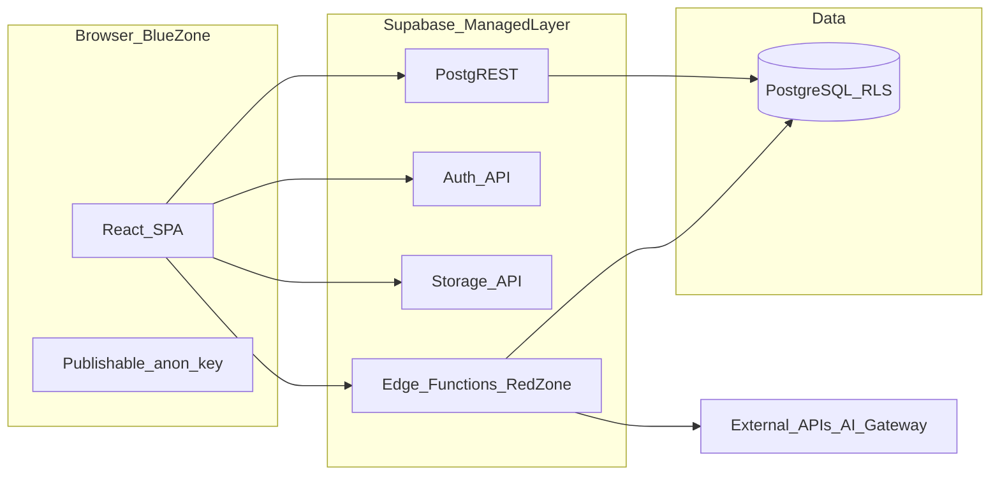
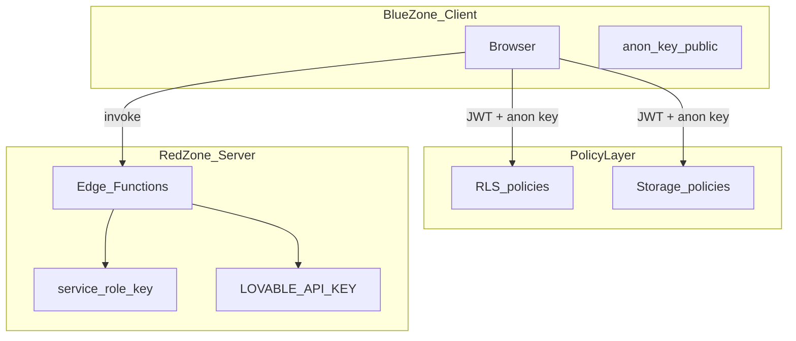
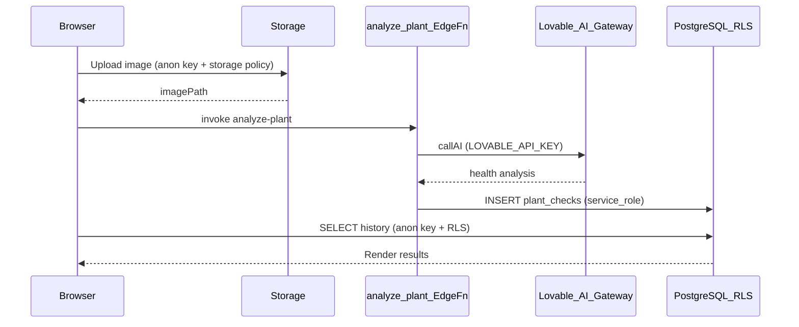

# Generated App Anatomy

This document describes **what Lovable generates** and **how generated applications run at runtime** — project structure, architectural patterns, security zones, and deployment paths.

For the full platform stack, see [system-design.md](./system-design.md). For POC free-tier hosting defaults, see [§7 POC Hosting](./system-design.md#7-infrastructure--devops). For reusable blocks, activation, and the admin dashboard, see [reusable-blocks.md](./reusable-blocks.md).

---

## Shared DNA

Every Lovable app is built on the same foundations. Feature sets differ, but the skeleton is rigid by design — standardization is what makes AI generation reliable.

| Layer | Technology | Role |
|-------|------------|------|
| Frontend | React + Vite + TypeScript | SPA bundled for the browser |
| UI | shadcn/ui + Tailwind CSS | Accessible components copied into the repo |
| Backend | Supabase (or Lovable Cloud) | Postgres, Auth, Storage, Edge Functions |
| AI features | Lovable AI Gateway | Server-side LLM access via edge functions |

**Four Supabase primitives** appear in virtually every full-stack app:

- **Database** — PostgreSQL exposed via PostgREST (REST over HTTP)
- **Auth** — JWT-based sessions; tokens sent with every API request
- **Storage** — Object storage for uploads and media
- **Edge Functions** — Deno serverless functions for secrets and complex logic

---

## Standard Project Structure

```
app/
├── src/
│   ├── components/              # UI components (incl. shadcn/ui)
│   ├── pages/                   # Route-level pages
│   ├── features/                # Reusable blocks (auth, admin, storage, …)
│   ├── services/                # Client-side API wrappers
│   └── integrations/supabase/   # Supabase client + generated types
├── supabase/
│   ├── functions/<name>/        # Deno edge functions
│   └── migrations/              # Schema + RLS + storage policies
└── [vite, tailwind, ts configs]
```

**Execution context split:**

- Everything in `src/` is bundled and runs in the **user's browser**
- Everything in `supabase/functions/` runs on **Supabase infrastructure**

The frontend is shipped as a static SPA served via CDN. All Supabase primitives are accessed over public HTTPS endpoints.

---

## Example: Plant Pal File Tree

Plant Pal is a minimal app that uploads a plant photo and returns an AI health check. It illustrates how Lovable maps features to Supabase primitives:

```
plant-pal/
├── src/
│   ├── components/
│   ├── pages/
│   │   ├── AnalyzePage.tsx            # Image upload page
│   │   └── HistoryPage.tsx            # Plant history page
│   ├── services/
│   │   └── plantService.ts            # Three functions, three primitives
│   │       ├── uploadPlantImage()     # → Storage
│   │       ├── analyzePlant()         # → Edge function
│   │       └── getPlantHistory()      # → Database
│   └── integrations/supabase/         # Shared Supabase client
├── supabase/
│   ├── functions/analyze-plant/       # AI Gateway call + DB write
│   └── migrations/
│       └── 20251222...sql             # Table defs + RLS + storage policies
└── .env                               # Publishable anon key only
```

### Service layer pattern

The service layer wraps the Supabase client and exposes clean functions to pages. Each function maps to exactly one primitive:

```typescript
// uploadPlantImage() → Storage
supabase.storage.from("plant-images").upload(path, file);

// getPlantHistory() → Database
supabase.from("plant_checks").select("*").order("created_at", { ascending: false });

// analyzePlant() → Edge Function
supabase.functions.invoke("analyze-plant", { body: { imagePath, userId } });
```

Pages import from `plantService.ts` — they never call Supabase directly. This keeps UI logic separate from data access and gives the agent a consistent pattern to follow.

---

## 2-Tier vs 3-Tier Architecture

### Classic 3-tier

```
Browser → Application server (Node/Python) → Database
```

The application server validates inputs, implements business logic, and controls which database operations are allowed. More code and infrastructure, but clear separation of concerns.

### Classic 2-tier

```
Browser → Database
```

Simpler, but authorization must live in the database itself.

### Where Lovable lands

Lovable + Supabase sits **between** 2-tier and 3-tier:

```
Browser → PostgREST / Auth / Storage / Edge Functions → PostgreSQL
```

PostgREST, Auth endpoints, and Storage APIs form a **thin managed middle layer** — you don't write or control that code. Business logic is split:

| Complexity | Where logic lives |
|------------|-------------------|
| Simple CRUD | Frontend orchestrates UI; browser talks directly to PostgREST/Storage; **RLS enforces authorization** |
| Secrets, external APIs, AI | Browser invokes **Edge Functions** that hold server-side keys |

This hybrid model reduces moving parts, which makes the codebase easier for the AI to generate and evolve.



---

## Security Zones

Generated apps use two security zones. The distinction is the key to understanding Lovable app security.

### Blue zone (client)

Everything the browser accesses directly using Supabase's **publishable anon key**. This key is bundled into JavaScript at build time — it is public and inspectable by anyone.

Access is constrained by:

- **Row Level Security (RLS)** on database tables
- **Storage policies** on buckets

The anon key alone grants no privileged access. RLS policies determine which rows a user can read or write (e.g. `user_id = auth.uid()`).

### Red zone (server)

Everything in Edge Functions. Users can invoke them, but cannot see the code or secrets inside.

Secrets that live here:

- `service_role` key (bypasses RLS — never in browser)
- `LOVABLE_API_KEY` for AI Gateway calls
- Third-party API keys (Stripe, email providers, etc.)



---

## Example Runtime Flow: AI Feature

End-to-end flow for Plant Pal's analyze feature:



1. Browser uploads image to Supabase Storage using the publishable key
2. Browser invokes the `analyze-plant` Edge Function
3. Edge Function calls the Lovable AI Gateway with a server secret
4. Edge Function writes the result to the database using the service-role key
5. Browser reads plant history via PostgREST; RLS ensures the user sees only their rows

---

## RLS as Primary Authorization

Because the anon key is **designed to be public**, authorization cannot rely on hiding credentials. **Row Level Security** is the primary access control mechanism.

RLS attaches policies directly to PostgreSQL tables:

```sql
-- Users can only read their own plant checks
CREATE POLICY "Users read own checks"
  ON plant_checks FOR SELECT
  USING (user_id = auth.uid());
```

**Why this matters for Lovable apps:**

- No custom API server means no server-side middleware for auth checks on CRUD
- Every table holding user data **must** have RLS enabled with restrictive policies
- Permissive policies like `USING (true)` on user-owned data are a critical security flaw
- Production deployments require human review of generated RLS policies

Edge Functions complement RLS for operations that cannot be expressed as policies (calling external APIs, batch writes, admin aggregations).

---

## Deployment Paths

Generated apps are standard React/TypeScript projects. For **POC and prototyping**, use the free-tier path below — cold starts on Edge Functions and occasional Supabase project pauses are acceptable.

### Recommended: Vercel Hobby + Supabase free (POC)

| Layer | Service | Notes |
|-------|---------|-------|
| **Frontend** | Vercel Hobby (free) | `vite build` → deploy `dist/` as a static SPA |
| **Backend** | Supabase free tier | Postgres, Auth, Storage, Edge Functions (Deno) |

**Why this is the default for POC:** zero cost, no infra to manage, standard export path. You do **not** need low latency, always-warm functions, or custom CDN edge tuning.

**Client env vars** — only these belong in the browser bundle (`.env` / Vercel project settings):

```bash
VITE_SUPABASE_URL=https://<project-ref>.supabase.co
VITE_SUPABASE_ANON_KEY=<publishable-anon-key>
```

Never expose `service_role` keys or third-party secrets in the frontend. Edge Functions read secrets from Supabase project settings.

**SPA routing on Vercel** — add `vercel.json` at the repo root so client-side routes (React Router) resolve on refresh:

```json
{
  "rewrites": [{ "source": "/(.*)", "destination": "/index.html" }]
}
```

**POC tradeoffs to expect:**

- Edge Functions may **cold-start** after inactivity (several seconds) — fine for demos
- Supabase free projects **pause after ~1 week** of inactivity; restore from the dashboard
- Vercel Hobby is **non-commercial** only

Deploy edge functions via Supabase CLI (`supabase functions deploy`) or the Supabase dashboard; the SPA on Vercel calls them over HTTPS like any other Supabase client.

### Other deployment paths

| Path | Description | Backend | When to use |
|------|-------------|---------|-------------|
| **Vercel Hobby + Supabase free** | *(above)* | Supabase free tier | **Default for POC** |
| **GitHub export → Vercel** | Export repo, connect to Vercel, set env vars | Unchanged — Supabase | Team handoff while staying on free tier |
| **Lovable hosting** | One-click publish to CDN (`*.lovable.app`); custom domain | Lovable Cloud or connected Supabase | Staying on the Lovable platform (usage-based) |
| **Production self-host** | `vite build` → Netlify, S3+CloudFront, etc. | Supabase (paid tier typical) | Latency SLAs, commercial hosting, scale |

The static frontend has no application server. All backend state remains in Supabase regardless of where the SPA is hosted.

For platform-level infra (Cloudflare R2, Kafka, preview sandboxes at scale), see [system-design.md §7](./system-design.md#7-infrastructure--devops) — that applies to **Lovable itself**, not POC deployment.

---

## Related Documentation

- [system-design.md](./system-design.md) — Platform architecture, backend MCP, [POC hosting (free tier)](./system-design.md#7-infrastructure--devops)
- [reusable-blocks.md](./reusable-blocks.md) — Block catalog, activation model, admin dashboard
- [agent-loop.md](./agent-loop.md) — How the AI agent generates and iterates on apps
