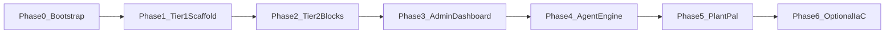
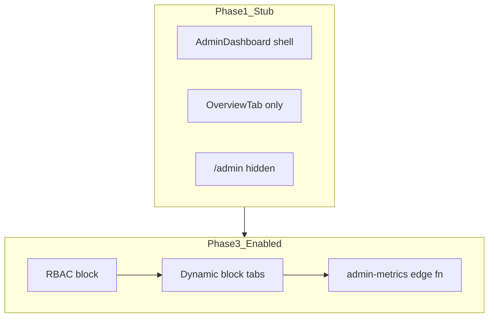

# Implementation Plan — Lovable-Style POC

This document defines **how to implement** the platform described in the architecture docs. It is the execution companion to [system-design.md](./system-design.md), [reusable-blocks.md](./reusable-blocks.md), [generated-app-anatomy.md](./generated-app-anatomy.md), and [agent-loop.md](./agent-loop.md).

**Current repo state (Phase 0 baseline):** documentation only — five markdown files under `docs/`. No application code, no Supabase project, no CI, no scaffold.

**POC constraints:**

- **Minimal scope** — ship a working scaffold + one reference app (Plant Pal) before building a full platform UI.
- **Incremental delivery** — each phase produces a deployable artifact on Vercel Hobby + Supabase free.
- **Frozen blocks first** — cross-cutting infrastructure is human-reviewed once; the agent generates domain code only.
- **Security by default** — RLS on every user-owned table; secrets only in edge functions / Supabase secrets.
- **IaC throughout** — every infra surface is version-controlled; no dashboard-only drift for schema or deploy config.

**Hosting target:** [Vercel Hobby](https://vercel.com/docs/plans/hobby) + [Supabase free tier](https://supabase.com/pricing). Cold starts and manual Supabase project restores after inactivity are acceptable.

---

## 1. Repo structure recommendation

### Monorepo (recommended)

Use a **pnpm monorepo** with Turborepo for task orchestration. A single repo keeps the frozen scaffold, block registry, agent core, and platform UI in sync — critical because block contracts must match activation recipes and protected paths.

```
project-root/
├── apps/
│   ├── scaffold/                 # Canonical generated-app template (Tier 1–3 blocks)
│   └── platform/                 # Lovable-style builder UI (Phase 4+, simplified POC)
├── packages/
│   ├── block-registry/           # lovable.blocks.json schema, activation recipes
│   ├── agent-core/               # Change planner, work classification, prompt templates
│   └── shared/                   # Shared types, env schema, lint config
├── docs/                         # Architecture + this plan (existing)
├── infra/                        # Optional Terraform (Phase 6+ only)
├── .github/workflows/            # CI: lint, typecheck, migrate validate, deploy
├── pnpm-workspace.yaml
├── turbo.json
├── LOVABLE.md                    # Policy-as-code: protected paths, agent boundaries
└── README.md                     # Root onboarding
```

**Why not a single flat app?** The scaffold must be **exportable** as a standalone repo (GitHub export path). Keeping it in `apps/scaffold` with a `pnpm export:scaffold` script (copy + strip monorepo refs) mirrors the Lovable export model without maintaining two repos during POC.

**Why not separate repos yet?** POC velocity. Split to separate `scaffold` + `platform` repos only when external contributors need scaffold-only access.

### What gets built vs docs-only (POC)

| Area | Built in POC | Docs-only / deferred |
|------|--------------|----------------------|
| Frozen scaffold (`apps/scaffold`) | Yes — full Tier 1, Tier 2 stub→enabled, admin shell | — |
| Block registry + manifest validation | Yes | — |
| Supabase migrations + edge fn boilerplate | Yes | — |
| Plant Pal reference app | Yes — proves end-to-end generation pattern | — |
| Platform chat UI | Simplified — single-thread chat, file tree, preview iframe | Visual Edits AST, Code mode bidirectional merge |
| Agent loop | Simplified — chat + templates + block activation scripts | Full MCP bidirectional Supabase orchestration |
| Live preview sandboxes at scale | Local Vite dev server + optional Vercel preview deploy | Isolated per-session Cloudflare/GCP sandboxes |
| Lovable Cloud / AI Gateway | Mock in edge fn stub; optional real key via Supabase secret | Managed Lovable Cloud provisioning |
| Tier 3 blocks (Stripe, multi-tenant) | Stub files only | Full activation recipes |
| Enterprise governance CI | Basic protected-path lint script | Full PR policy engine |
| Terraform / Pulumi | Documented optional path; not required for POC | — |
| Kafka, Snowflake, custom CDN | — | Entirely out of scope (see system-design §7) |

---

## 2. IaC strategy

### Pragmatic choice: native tooling first, Terraform optional later

| Tool | POC role | Rationale |
|------|----------|-----------|
| **Supabase CLI** | **Primary** — schema, RLS, seeds, edge functions, local stack | Official path for migrations; `supabase db push` in CI; local `supabase start` for integration tests |
| **Vercel project config** | **Primary** — `vercel.json`, env schema, preview deploys | Hobby tier needs no API provisioning; config-as-code is sufficient |
| **GitHub Actions** | **Primary** — lint, typecheck, migrate validate, deploy | Standard CI/CD; free for public repos |
| **`lovable.blocks.json`** | **Primary** — declarative block activation state | Drives dashboard tabs, agent classification, activation recipes |
| **`LOVABLE.md`** | **Primary** — protected paths, agent policy | Human + CI gate on block rewrites |
| **Terraform (Supabase provider)** | **Optional Phase 6+** | Adds value for multi-project / multi-env provisioning, bucket + settings sync — **not worth POC onboarding cost** |
| **Terraform (Vercel provider)** | **Skip for POC** | Vercel Hobby projects are linked via CLI/dashboard once; `vercel.json` covers routing |
| **Pulumi** | **Skip for POC** | Same tradeoff as Terraform; choose Terraform if IaC expansion is needed (better Supabase provider maturity) |

**POC bootstrap flow (no Terraform):**

1. Create Supabase project manually (dashboard) — one-time, free tier.
2. `supabase link --project-ref <ref>` — binds local CLI to remote.
3. Connect Vercel to GitHub; set `VITE_SUPABASE_*` env vars in Vercel project settings (documented in `.env.example`).
4. All subsequent changes flow through git → CI → `supabase db push` / `supabase functions deploy` / Vercel auto-deploy.

**When to add Terraform:** second environment (staging), agency multi-client provisioning, or automated project creation in CI. Import existing project via `supabase_project` resource; keep migrations in Supabase CLI (Terraform does not replace SQL migrations).

### IaC inventory table

| Concern | Owner file(s) | Tooling | CI validation |
|---------|---------------|---------|---------------|
| Postgres schema + RLS | `apps/scaffold/supabase/migrations/*.sql` | Supabase CLI | `supabase db lint`, `supabase db push --dry-run` (linked project) |
| Local Supabase config | `apps/scaffold/supabase/config.toml` | Supabase CLI | `supabase start` in integration job |
| Seed data | `apps/scaffold/supabase/seed.sql` | Supabase CLI | Applied on local + optional staging |
| Edge functions | `apps/scaffold/supabase/functions/**` | Supabase CLI | Deno lint + deploy on main |
| Edge fn secrets | Supabase dashboard / CLI secrets | Supabase secrets API | Documented in `.env.example`; never in git |
| SPA routing | `apps/scaffold/vercel.json` | Vercel | Preview deploy smoke test |
| Frontend env schema | `apps/scaffold/.env.example`, `src/lib/env.ts` | Zod validation | Build fails on missing vars |
| Block activation state | `apps/scaffold/lovable.blocks.json` | block-registry package | JSON schema validate in CI |
| Agent policy | `LOVABLE.md` (repo root) | Custom lint script | CI checks protected-path diffs |
| Block metrics registry | `src/features/*/metrics.tab.ts` | TypeScript | Typecheck |
| GitHub CI | `.github/workflows/ci.yml` | GitHub Actions | Required on PR |
| Deploy (main) | `.github/workflows/deploy.yml` | GitHub Actions + Vercel + Supabase | Manual approval optional |
| Docs site | `docs/.vitepress/config.ts` (optional) | VitePress on Vercel Hobby | Link check |
| Multi-env infra (future) | `infra/terraform/*.tf` | Terraform | `terraform plan` on PR |

---

## 3. Implementation phases



---

### Phase 0 — Repo bootstrap & IaC skeleton

**Goal:** Turn the docs-only repo into a buildable monorepo with CI gates and empty deploy paths.

**Deliverables:**

- [ ] pnpm workspace + Turborepo (`pnpm-workspace.yaml`, `turbo.json`)
- [ ] `apps/scaffold` — Vite + React + TypeScript + Tailwind + shadcn/ui init
- [ ] `apps/scaffold/supabase/` — `supabase init`, `config.toml`, empty `migrations/`
- [ ] `apps/scaffold/vercel.json` — SPA fallback rewrite
- [ ] `apps/scaffold/.env.example` — `VITE_SUPABASE_URL`, `VITE_SUPABASE_ANON_KEY`
- [ ] `LOVABLE.md` — protected paths from [reusable-blocks.md](./reusable-blocks.md)
- [ ] `.github/workflows/ci.yml` — lint, typecheck, block manifest schema validate
- [ ] Root `README.md` — clone → install → local dev instructions

**Dependencies:** None.

**Exit criteria:** `pnpm build` passes; CI green on empty scaffold; Vercel project linked (deploy shows placeholder SPA).

**Testing:**

- Unit: env validation rejects missing keys in production mode
- CI: ESLint + TypeScript strict on scaffold
- Manual: Vercel preview loads; Supabase project linked

---

### Phase 1 — Tier 1 frozen blocks (always present)

**Goal:** Ship the immutable scaffold every generated app inherits. No agent required yet.

**Block order (Tier 1 — implement in this sequence):**

| # | Block | Key files |
|---|-------|-----------|
| 1 | Env & config | `.env.example`, `src/lib/env.ts` |
| 2 | Design system | `src/components/ui/*` (shadcn init) |
| 3 | Error boundary + toasts | `ErrorBoundary.tsx`, toast provider |
| 4 | Supabase client | `src/integrations/supabase/client.ts`, `types.ts` (stub types) |
| 5 | App shell & routing | `App.tsx`, `routes.tsx`, `layouts/AppLayout.tsx`, 404 |
| 6 | Admin dashboard (shell only) | `src/features/admin/*` — Overview tab, hidden `/admin` route |
| 7 | `lovable.blocks.json` | Tier 1 blocks `enabled`; Tier 2+ `stub` |

**Deliverables:**

- [ ] All Tier 1 blocks with stable contracts documented in block README files
- [ ] `packages/block-registry` — JSON schema for manifest + validation CLI
- [ ] Stub Supabase client: clear error when env vars unset
- [ ] Admin dashboard: Overview tab only; `/admin` hidden until RBAC (Phase 3)

**Dependencies:** Phase 0.

**Exit criteria:** Deployed SPA with landing page, working UI primitives, stub Supabase client, admin shell reachable only via direct URL (no nav link).

**Testing:**

- Component: ErrorBoundary catches render errors
- Unit: `env.ts` validates client-only keys; rejects `service_role` in `VITE_*`
- E2E (Playwright): landing page loads; 404 for unknown routes
- Contract: exports from `src/features/admin/index.ts` and `src/integrations/supabase/client.ts` stable

---

### Phase 2 — Tier 2 cross-cutting blocks (stub → enabled)

**Goal:** Implement activation recipes for cross-cutting blocks. Agent (later) flips manifest state; humans can activate manually for POC.

**Block order (Tier 2):**

| # | Block | Activation recipe |
|---|-------|-------------------|
| 1 | Edge function boilerplate | `supabase/functions/_shared/cors.ts`, `supabase-admin.ts` |
| 2 | Authorization / RLS helpers | `migrations/0001_rls_helpers.sql` |
| 3 | Auth | `migrations/0002_auth_profiles.sql`, `src/features/auth/*`, `/login`, `/signup` |
| 4 | Storage | `migrations/0003_storage.sql`, `src/features/storage/upload.ts` |
| 5 | AI gateway (mock) | `supabase/functions/_shared/ai-gateway.ts` — mock unless secret set |
| 6 | Realtime | `src/features/realtime/subscribe.ts` — no-op stub |
| 7 | Email / notifications | `supabase/functions/send-email/` — log-only stub |

**Deliverables:**

- [ ] `packages/block-registry/src/recipes/` — deterministic activation scripts per block
- [ ] Recipe CLI: `pnpm blocks:activate auth` → updates manifest + runs migrations + mounts routes
- [ ] Auth enabled path: email login, session listener, `profiles` table + RLS
- [ ] Storage enabled path: `uploads` bucket + policies
- [ ] All Tier 2 blocks remain **stub by default** in committed manifest

**Dependencies:** Phase 1.

**Exit criteria:** `pnpm blocks:activate auth` on local Supabase → login flow works; `pnpm blocks:deactivate auth` returns to stub without breaking imports.

**Testing:**

- Integration (local Supabase): auth signup → JWT → RLS-scoped profile read
- Integration: storage upload respects bucket policy
- Security: RLS enabled on `profiles`; anon cannot read other users' rows
- Unit: stub `useAuth()` returns `{ user: null, loading: false }` without network
- Migration: `supabase db reset` idempotent

---

### Phase 3 — Admin dashboard + metrics

**Goal:** Block-aware admin UI with stub → enabled metrics path.

**Deliverables:**

- [ ] Admin/RBAC block (Tier 3 subset, needed early): `user_roles` table, `useRole()`, `isAdmin()`, `<ProtectedRoute requireAdmin>`
- [ ] Enable `/admin` in nav when RBAC block enabled
- [ ] `useEnabledBlockTabs()` — reads manifest + metrics registry
- [ ] Frozen components: `MetricCard`, `MetricChart`, `BlockTabRenderer`
- [ ] Per-block `metrics.tab.ts` for Auth, Storage, AI (stub blocks omit tab)
- [ ] `supabase/functions/admin-metrics/` — router with admin JWT + role check
- [ ] Handlers: `auth.ts`, `storage.ts`, `ai.ts` (frozen query logic)
- [ ] Materialized view or simple aggregation for auth signups (optional pg_cron stub)

**Activation interaction:**

| Event | Dashboard behavior |
|-------|-------------------|
| Scaffold only | Overview tab; `/admin` hidden |
| RBAC enabled | `/admin` visible to admins |
| Auth enabled | Users tab + signup charts |
| Storage enabled | Storage tab |
| AI enabled | AI Usage tab |

**Dependencies:** Phase 2 (auth, edge fn boilerplate).

**Exit criteria:** Admin user sees Auth metrics after auth block activation; non-admin gets 403 from edge fn; service_role never exposed to browser.

**Testing:**

- Integration: admin-metrics rejects non-admin JWT
- Integration: auth metrics return expected counts against seed users
- Unit: `useEnabledBlockTabs` filters stub blocks
- Security: dashboard API calls use user JWT; edge fn uses service_role server-side only
- E2E: admin login → dashboard → Users tab renders

---

### Phase 4 — Agent / codegen engine (honest POC scope)

**Goal:** Minimal loop that demonstrates Spec → Context → Plan → Build → Feedback without full Lovable platform infrastructure.

**POC scope (build):**

| Component | POC implementation |
|-----------|-------------------|
| Chat UI | `apps/platform` — single conversation, message list, prompt input |
| Change planner | Rule-based classifier + LLM for `feature generation` only |
| Block activation | Deterministic — BlockRegistry recipes, **no LLM** |
| Code generation | LLM produces patches for `src/pages`, `src/services`, `src/components`, domain migrations |
| Context manager | File tree snapshot + manifest + last N messages (bounded) |
| Build gate | Spawn `pnpm build` in scaffold; surface TS/Vite errors to chat |
| Preview | iframe → local Vite dev URL or latest Vercel preview |
| Plan mode | Show diff preview before apply (simple git-style or Monaco diff) |
| Backend orchestration | **Supabase CLI subprocess** — not full MCP server |

**POC scope (defer):**

- Full MCP server with schema read/write, log streaming, secrets management
- Visual Edits (AST manipulation)
- Agent mode with web search
- Version history / revert artifacts in chat
- Multi-session memory

**Architecture:**

```
apps/platform/
├── src/
│   ├── chat/              # UI
│   └── api/               # POST /api/agent-turn → agent-core
packages/agent-core/
├── classifier.ts          # Work classification (4 types)
├── planner.ts             # Merge registry + LLM patches
├── context.ts             # Bounded snapshot builder
├── prompts/               # System prompts with block contracts
└── apply.ts               # Write patches to apps/scaffold workspace
packages/block-registry/
├── schema.json
├── recipes/
└── activate.ts
```

**Agent boundary enforcement:**

- Prompt includes protected paths from `LOVABLE.md`
- Post-apply CI script: fail if protected files changed without override flag
- LLM prompt lists **contracts only** (`useAuth`, `supabase`, `ProtectedRoute`) — not implementations

**Dependencies:** Phases 1–3.

**Exit criteria:** User prompt *"Add a plants page that lists my plants"* → agent generates page + service + migration; build passes; preview updates. Prompt *"Add login"* → block activation only, no AuthProvider rewrite.

**Testing:**

- Unit: classifier routes "add login" → `block_activation`, not `feature_generation`
- Unit: classifier routes "build todo app" → `feature_generation`
- Integration: agent turn with mock LLM produces valid patch set
- Integration: protected path edit rejected
- E2E: chat prompt → preview updates (happy path)

---

### Phase 5 — Plant Pal reference app

**Goal:** End-to-end validation of the Lovable pattern described in [generated-app-anatomy.md](./generated-app-anatomy.md).

**Deliverables:**

- [ ] Activate blocks: auth, storage, AI (mock or real gateway secret)
- [ ] Domain migration: `plant_checks` table + RLS
- [ ] `src/services/plantService.ts` — upload, analyze, history
- [ ] Pages: `AnalyzePage`, `HistoryPage`
- [ ] Edge fn: `supabase/functions/analyze-plant/` — AI call + DB write (red zone)
- [ ] Storage bucket: `plant-images`
- [ ] Optional: generate via agent (Phase 4) vs hand-written seed — document both paths

**Dependencies:** Phases 2–4.

**Exit criteria:** Deployed on Vercel + Supabase free; user can sign up, upload plant photo, get AI analysis, view history; RLS isolates rows per user.

**Testing:**

- E2E: full Plant Pal flow (signup → upload → analyze → history)
- Security: user A cannot read user B plant_checks
- Integration: analyze-plant rejects unauthenticated invoke
- Manual: cold start on edge fn acceptable (<10s)

---

### Phase 6 — Optional hardening & Terraform

**Goal:** Production-adjacent improvements only if POC succeeds.

**Deliverables (pick based on need):**

- [ ] `infra/terraform/` — Supabase project import, storage buckets, settings
- [ ] GitHub Actions: automated `supabase db push` + `functions deploy` on main
- [ ] Tier 3 stubs: payments, multi-tenant — activation recipes
- [ ] `pnpm export:scaffold` — standalone repo export
- [ ] Docs site via VitePress on Vercel

**Dependencies:** Phase 5.

---

## 4. Block implementation order (summary)

| Tier | Order | Blocks |
|------|-------|--------|
| **Tier 1** | 1→7 | Env, design system, error/toast, Supabase client, app shell, admin shell, manifest |
| **Tier 2** | 1→7 | Edge boilerplate, RLS helpers, auth, storage, AI gateway, realtime stub, email stub |
| **Tier 3** | On demand | RBAC (early — Phase 3), settings/profile, landing, SEO, payments stub, multi-tenant stub, CRUD resource block |

**Rule:** Tier 1 ships before any agent work. Tier 2 recipes before Tier 3. Admin RBAC pulled forward to Phase 3 because dashboard requires it.

---

## 5. Admin dashboard implementation path



| Stage | `/admin` | Tabs | Metrics source |
|-------|----------|------|----------------|
| Phase 1 | Hidden | Overview only (direct URL ok) | Static placeholder |
| Phase 3a | Visible if admin | Overview + enabled block tabs | `admin-metrics` edge fn |
| Phase 3b | Full | Charts + date range | Materialized views / aggregations |

Custom domain tabs (`customTabs` in manifest) are **agent-generated** in Phase 4+ — not part of frozen dashboard layout.

---

## 6. Agent / codegen engine — POC honesty

The docs describe Lovable's production agent (MCP, sandboxes at scale, Visual Edits). For this POC:

**What "done" looks like:**

- User chats in `apps/platform`
- Change planner classifies work; block activations run recipes without LLM
- LLM generates domain code only, against frozen contracts
- `pnpm build` gate prevents broken preview
- Supabase CLI applies migrations and deploys edge fns (subprocess, not MCP protocol)

**What we are NOT building in POC:**

- MCP server implementation (use CLI + REST where needed)
- Per-session isolated cloud sandboxes (local Vite + Vercel preview suffices)
- Visual Edits, Code mode merge conflict handling
- Credit metering, version revert from chat history

**Upgrade path:** Replace Supabase CLI subprocess with MCP tools (`apply_migration`, `deploy_function`, `get_logs`) when backend orchestration needs log-driven debug loops — the agent-core interfaces should abstract `BackendOrchestrator` either way.

---

## 7. Testing strategy by phase

| Phase | Unit | Integration | E2E | Security |
|-------|------|-------------|-----|----------|
| 0 | env validation | — | — | — |
| 1 | UI primitives, env | — | landing, 404 | no secrets in client bundle |
| 2 | stub hooks, recipes | local Supabase auth/storage | login flow | RLS policies, anon key scoped |
| 3 | tab registry, hooks | admin-metrics handlers | admin dashboard | admin JWT gate, no service_role in browser |
| 4 | classifier, planner | patch apply + build | chat → preview | protected path CI gate |
| 5 | plantService | analyze-plant fn | Plant Pal full flow | cross-user RLS isolation |
| 6 | terraform validate | deploy pipeline | export smoke | secret scanning |

**Test tooling:**

- **Vitest** — unit + component tests
- **Playwright** — E2E against local Vite + local Supabase (`supabase start`)
- **Deno test** — edge function handlers (optional)
- **CI:** all tests on PR; deploy workflow on main only after pass

**Meaningful behavior only:** no tests that assert `useAuth` returns an object; test that stub auth redirects unauthenticated users and enabled auth persists session across reload.

---

## 8. Free tier hosting alignment

| Concern | POC approach |
|---------|--------------|
| Frontend | Vercel Hobby — static `dist/`, SPA rewrite in `vercel.json` |
| Backend | Supabase free — linked via CLI |
| Edge functions | Supabase-hosted Deno; cold starts OK |
| Env vars | `VITE_*` in Vercel; secrets in Supabase project settings |
| Project pause | Document restore steps in README; CI weekly ping optional |
| Commercial use | Vercel Hobby non-commercial — POC/demo only |
| CDN / latency | Default routing; no custom edge tuning |

**Deploy pipeline (main branch):**

1. CI: lint → typecheck → test → `supabase db push` (linked project)
2. CI: `supabase functions deploy` (changed functions only)
3. Vercel: auto-deploy on push (GitHub integration)

---

## 9. CI/CD workflow sketch

```yaml
# .github/workflows/ci.yml (conceptual)
on: [pull_request, push]
jobs:
  validate:
    - pnpm install
    - pnpm lint
    - pnpm typecheck
    - pnpm test
    - pnpm blocks:validate-manifest
    - pnpm policy:check-protected-paths  # diff against LOVABLE.md
  supabase:
    - supabase start
    - supabase db reset
    - pnpm test:integration
```

```yaml
# .github/workflows/deploy.yml (conceptual)
on:
  push:
    branches: [main]
jobs:
  deploy-backend:
    - supabase link (secrets)
    - supabase db push
    - supabase functions deploy
  # Vercel deploys frontend via GitHub integration automatically
```

---

## 10. First implementation sprint (recommended)

If starting immediately after this plan:

1. **Week 1:** Phase 0 + Phase 1 (monorepo, Tier 1 scaffold, CI)
2. **Week 2:** Phase 2 auth + storage recipes, local Supabase integration tests
3. **Week 3:** Phase 3 admin dashboard + admin-metrics edge fn
4. **Week 4:** Phase 4 simplified agent + Phase 5 Plant Pal E2E

Adjust based on team size. Do not start Phase 4 until Tier 2 activation recipes are deterministic — otherwise the agent will regenerate block internals.

---

## Related documentation

- [system-design.md](./system-design.md) — platform architecture
- [reusable-blocks.md](./reusable-blocks.md) — block catalog and activation model
- [generated-app-anatomy.md](./generated-app-anatomy.md) — runtime anatomy and deployment
- [agent-loop.md](./agent-loop.md) — five-step agent loop
- [README.md](./README.md) — doc index
