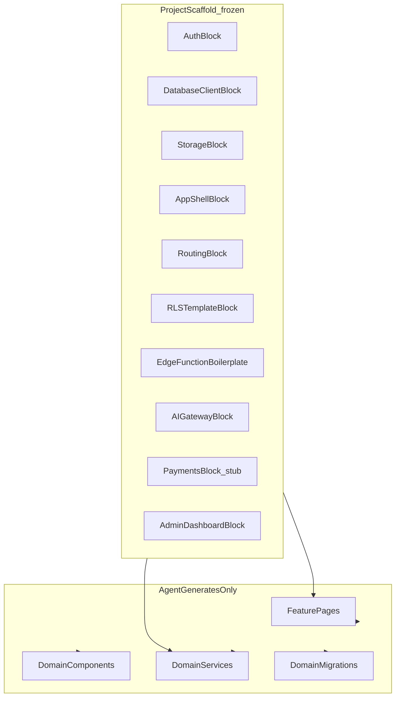
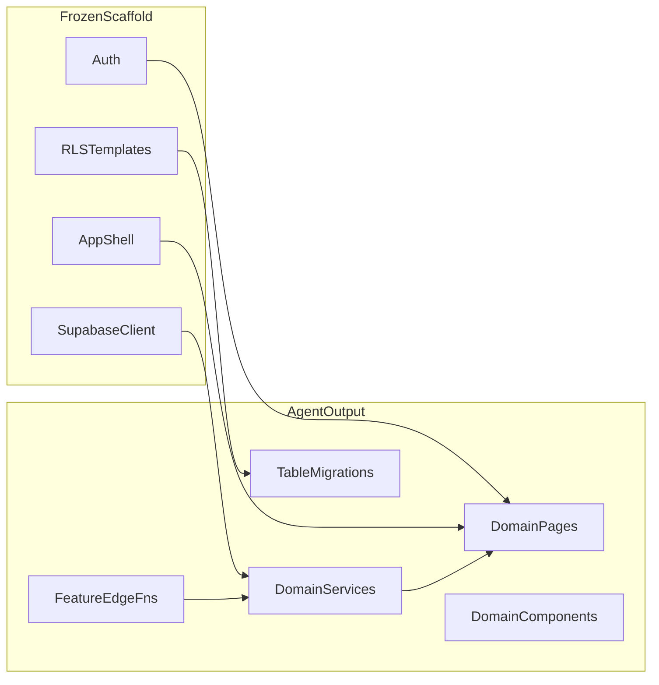
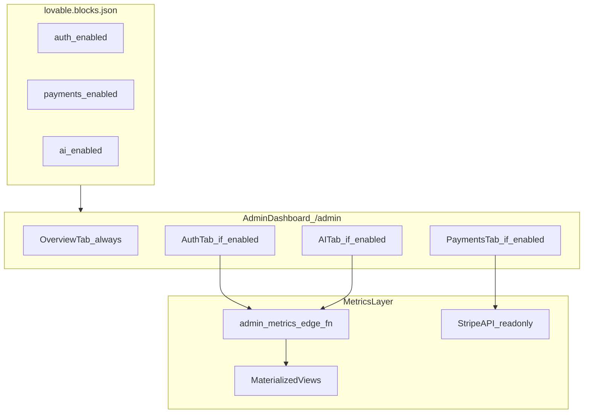
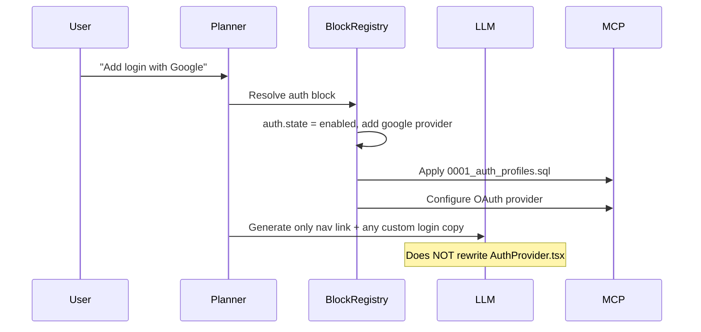

# Reusable Platform Blocks (Scaffold, Don't Regenerate)

> Part of the [Lovable platform system design](./system-design.md). For how the agent classifies and applies changes against blocks, see [Agent orchestration loop](./agent-loop.md).

The code generation engine should **not rebuild cross-cutting infrastructure from scratch on every prompt**. Instead, every new project ships with a **fixed scaffold of reusable blocks** — stable file paths, stable APIs, stable wiring — that the agent **activates, extends, or leaves stubbed** depending on user intent.

---

## Design principle

Each block has three properties:

| Property | Meaning |
|----------|---------|
| **Stable contract** | Public hooks (`useAuth()`, `supabase` client, `ProtectedRoute`) never move or rename across projects |
| **Activation state** | `enabled` (fully wired) or `stub` (no-op / placeholder UI, but imports still resolve) |
| **Agent boundary** | Agent edits *inside* the block only when configuring; edits *outside* when building features |



**Rule for the agent:** compose feature code *against* block contracts; never rewrite block internals unless the user explicitly asks to change auth provider, payment vendor, etc.

---

## Activation model

Blocks are declared in a project manifest (e.g. `lovable.blocks.json` or frontmatter in `LOVABLE.md`):

```json
{
  "blocks": {
    "auth": { "state": "enabled", "provider": "supabase", "methods": ["email", "google"] },
    "storage": { "state": "enabled", "buckets": ["uploads"] },
    "payments": { "state": "stub" },
    "ai": { "state": "enabled", "gateway": "lovable" },
    "realtime": { "state": "stub" }
  }
}
```

| State | Behavior |
|-------|----------|
| **enabled** | Fully wired; migrations applied; UI routes live |
| **stub** | Files exist, exports resolve, routes show placeholder or are hidden; zero backend side effects |
| **disabled** | Block files remain in scaffold but tree-shaken / not mounted (rare; prefer stub) |

When user says *"add login"* → agent flips `auth` from `stub` → `enabled` and runs the block's activation recipe (migration + route mount). It does **not** regenerate auth from zero.

---

## Block catalog

### Tier 1 — Always present (every project)

| Block | Stable paths | Contract (agent imports this) | Enabled | Stub |
|-------|-------------|-------------------------------|---------|------|
| **App shell & routing** | `src/App.tsx`, `src/routes.tsx`, `src/layouts/AppLayout.tsx` | `<AppLayout>`, route table, 404 page | Full nav + outlet | Single landing route |
| **Design system** | `src/components/ui/*` (shadcn) | Button, Input, Dialog, etc. | All primitives copied in | Same (always enabled) |
| **Supabase client** | `src/integrations/supabase/client.ts`, `types.ts` | `supabase` singleton + generated `Database` type | Env vars set, types generated | Client throws clear "connect backend" error |
| **Env & config** | `.env.example`, `src/lib/env.ts` | Typed `env.VITE_SUPABASE_URL`, `env.VITE_SUPABASE_ANON_KEY` | Populated (client-only keys) | Validates but allows empty |
| **Error boundary** | `src/components/ErrorBoundary.tsx` | Wraps app root | Active | Active |
| **Toasts / feedback** | `src/components/ui/toast`, `useToast()` | Standard notification API | Active | Active |
| **Admin dashboard** | `src/features/admin/*`, `supabase/functions/admin-metrics/` | `<AdminDashboard>`, `useBlockMetrics(blockId)` | Dynamic tabs for enabled blocks; metrics via edge fn | Shell UI with "No blocks enabled" overview only |

### Tier 2 — Cross-cutting (stub by default, activate on demand)

| Block | Stable paths | Contract | Enabled behavior | Stub behavior |
|-------|-------------|----------|------------------|---------------|
| **Auth** | `src/features/auth/*`, `supabase/migrations/*_auth.sql` | `useAuth()`, `AuthProvider`, `<ProtectedRoute>`, `/login`, `/signup` | Email + OAuth via Supabase Auth; session listener; profile table + RLS | `useAuth()` returns `{ user: null, loading: false }`; routes exist but redirect nowhere |
| **Authorization / RLS** | `supabase/migrations/*_rls_helpers.sql` | `auth.uid()`, helper SQL functions | Policies on all user-owned tables | Base `profiles` policy only |
| **Storage** | `src/features/storage/upload.ts`, `supabase/migrations/*_storage.sql` | `uploadFile(bucket, file)`, `getPublicUrl()` | Bucket + policies created | Functions throw "enable storage block" |
| **Edge function boilerplate** | `supabase/functions/_shared/cors.ts`, `supabase/functions/_shared/supabase-admin.ts` | Shared Deno imports | Used by all edge fns | Template only, no deployed fns |
| **AI gateway** | `supabase/functions/_shared/ai-gateway.ts` | `callAI(prompt, options)` | Calls Lovable AI Gateway with secret | Returns mock response in dev |
| **Realtime** | `src/features/realtime/subscribe.ts` | `useRealtimeTable(table, filter)` | WebSocket subscriptions | No-op hook |
| **Email / notifications** | `supabase/functions/send-email/` | `sendEmail(to, template, data)` | Edge fn + provider secret | Log-only stub |

### Tier 3 — Domain-adjacent (opt-in blocks)

| Block | Stable paths | Contract | Notes |
|-------|-------------|----------|-------|
| **Payments (Stripe)** | `src/features/payments/*`, `supabase/functions/stripe-webhook/` | `createCheckoutSession()`, `<PricingTable>` | Stub until user connects Stripe keys |
| **Admin / RBAC** | `src/features/admin/rbac/*`, RLS role helpers | `useRole()`, `isAdmin()` | Gates `/admin` route; extends auth with `user_roles` table | Dashboard route hidden; `isAdmin()` always false |
| **Multi-tenant** | `src/features/tenant/*`, org-scoped RLS templates | `useOrg()`, `org_id` column convention | Heavy; explicit activation only |
| **File CRUD resource** | `src/features/crud/ResourcePage.tsx` | Generic list/create/edit from table schema | Agent passes table name + columns; block renders |
| **Settings / profile** | `src/pages/Settings.tsx`, `src/pages/Profile.tsx` | Standard account UI | Wired to auth + profiles table |
| **Landing / marketing** | `src/pages/Index.tsx`, `src/components/marketing/*` | Hero, features, CTA | Customized by agent; structure fixed |
| **SEO / meta** | `src/components/SEO.tsx`, `public/robots.txt`, `llms.txt` | `<SEO title description />` | Agent fills props only |

---

## What the agent generates vs what it reuses



| Agent **reuses** (never regenerates) | Agent **generates** (every project) |
|--------------------------------------|-------------------------------------|
| Auth provider, session, protected routes | Feature-specific pages and forms |
| Supabase client singleton + typegen hook | Domain services (`plantService.ts`) |
| shadcn/ui primitives | Business components |
| App layout, nav shell, 404 | Table schemas + RLS *for domain tables* |
| Edge fn shared utils (CORS, admin client) | Feature-specific edge functions |
| Error boundary, toasts, env validation | Custom migrations beyond block templates |
| Block activation recipes | Wiring: "call auth block, add route, add nav item" |

---

## Admin dashboard (block-aware metrics UI)

Every project includes a **frozen admin dashboard** at `/admin`. It is not regenerated per feature — the agent only activates it and mounts tabs as blocks become enabled.

### Core behavior

- **Tab visibility** — one tab per block where `lovable.blocks.json` state is `enabled` and the block exports a `metricsTab` definition. Disabled/stub blocks do not appear.
- **Access control** — route wrapped in `<ProtectedRoute requireAdmin>`. Requires Admin/RBAC block enabled; otherwise `/admin` is hidden from nav.
- **Overview tab** — always present; shows project health summary (enabled block count, last deploy, error rate if observability block enabled).
- **Agent boundary** — agent never rewrites dashboard layout, tab registry, or metric query logic; may only add custom domain tabs via a separate `customTabs` manifest entry.



### Block metrics registry

Each block declares a **metrics contract** in `src/features/<block>/metrics.tab.ts` (frozen scaffold file). The dashboard reads all registered tabs at build time and filters at runtime by activation state.

| Block | Tab label | Key metrics | Data source |
|-------|-----------|-------------|-------------|
| **Auth** | Users | Total users, new signups (7d/30d), DAU/WAU, signup conversion, auth method breakdown | `auth.users` + `profiles` aggregations via admin edge fn |
| **Payments** | Revenue | MRR, ARR, active subscriptions, churn rate, failed payments, LTV | Stripe API (read-only key) + local `subscriptions` mirror table |
| **Storage** | Storage | Total files, storage used (GB), uploads (7d), top buckets | Supabase Storage API + usage stats |
| **AI** | AI Usage | Requests (7d/30d), token usage, avg latency, cost estimate, top endpoints | Edge fn logs + `ai_usage` table |
| **Email** | Notifications | Emails sent (7d), delivery rate, bounce rate, top templates | Provider webhook events table |
| **Realtime** | Live | Active connections, messages/sec, subscribed channels | Supabase Realtime stats |
| **Database** | Database | Row counts per table, DB size, slow query count (if pg_stat enabled) | Postgres system views via service-role edge fn |

**Example metrics contract (Auth block — stable, not LLM-generated):**

```typescript
// src/features/auth/metrics.tab.ts
export const authMetricsTab = {
  blockId: "auth",
  label: "Users",
  icon: "Users",
  metrics: [
    { key: "total_users", label: "Total users", type: "number", trend: "30d" },
    { key: "new_users_7d", label: "New (7d)", type: "number", trend: "7d" },
    { key: "dau", label: "Daily active", type: "number" },
    { key: "signup_growth_pct", label: "Growth", type: "percent", trend: "30d" },
  ],
  charts: [
    { key: "signups_over_time", type: "line", range: ["7d", "30d", "90d"] },
    { key: "auth_method_split", type: "pie" },
  ],
  queryEndpoint: "admin-metrics/auth",  // edge fn route
};
```

When payments block activates → dashboard automatically gains a Revenue tab on next load; no agent prompt needed to "build admin UI."

### Admin dashboard file structure (frozen)

```
src/features/admin/
├── index.ts                    # Public: AdminDashboard, AdminLayout
├── AdminDashboard.tsx          # Tab shell + dynamic tab loader (stable)
├── AdminLayout.tsx             # Sidebar, header, date-range picker (stable)
├── hooks/
│   ├── useBlockMetrics.ts      # Fetches metrics for active tab
│   └── useEnabledBlockTabs.ts  # Reads manifest + metrics registry
├── components/
│   ├── MetricCard.tsx          # Reusable KPI card (stable)
│   ├── MetricChart.tsx         # Line/bar/pie wrappers (stable)
│   └── TabPlaceholder.tsx      # "Enable X block to see metrics"
├── tabs/
│   ├── OverviewTab.tsx         # Always mounted
│   └── BlockTabRenderer.tsx    # Renders any block's metrics contract
└── rbac/
    ├── useRole.ts
    └── ProtectedAdminRoute.tsx

supabase/functions/admin-metrics/
├── index.ts                    # Router: /auth, /storage, /ai, ...
├── _shared/aggregate.ts
└── handlers/
    ├── auth.ts                 # Frozen query logic per block
    ├── storage.ts
    └── ai.ts
```

### Metrics collection architecture

- **Never expose service-role key to browser** — all aggregations run through `admin-metrics` edge function; dashboard calls it with user JWT; edge fn verifies admin role before querying.
- **Prefer materialized views** for expensive auth/revenue rollups; refresh on schedule (pg_cron) or on webhook (Stripe `invoice.paid`).
- **Stripe MRR/ARR** — computed server-side from subscription mirror synced via webhook; dashboard never calls Stripe directly from client.
- **Caching** — edge fn returns `Cache-Control: max-age=60` for dashboard metrics; acceptable staleness for admin UI.

### Activation interaction

| Event | Dashboard behavior |
|-------|-------------------|
| Project scaffolded | Overview tab only; `/admin` hidden until RBAC enabled |
| Auth block enabled | Users tab appears; signup chart populates |
| Payments block enabled | Revenue tab appears; MRR/ARR cards populate after first Stripe sync |
| Block deactivated | Tab removed on next manifest read; historical data retained in DB |
| Agent adds custom domain | Optional `customTabs` entry in manifest points to agent-generated page — separate from block tabs |

```json
{
  "blocks": {
    "auth": { "state": "enabled" },
    "payments": { "state": "enabled" }
  },
  "admin": {
    "enabled": true,
    "customTabs": [
      { "id": "orders", "label": "Orders", "route": "/admin/orders" }
    ]
  }
}
```

Domain-specific admin pages (e.g. order management) are **agent-generated** and linked as custom tabs; block metric tabs remain frozen.

---

## Block internal structure (example: Auth)

```
src/features/auth/
├── index.ts              # Public API: useAuth, AuthProvider, ProtectedRoute
├── AuthProvider.tsx      # Session listener (stable)
├── ProtectedRoute.tsx    # Redirect logic (stable)
├── hooks/useAuth.ts      # Contract surface (stable)
├── pages/
│   ├── Login.tsx         # Customizable styling; flow stable
│   └── Signup.tsx
└── README.block.md       # Agent instructions: DO NOT rewrite core logic

supabase/migrations/
└── 0001_auth_profiles.sql  # profiles table + base RLS (stable template)
```

**Stub mode:** `AuthProvider` mounts but skips Supabase listener; login pages render with a banner *"Auth not configured"*. Imports in feature code still work:

```typescript
// Feature code always looks the same whether auth is stub or enabled
const { user } = useAuth();
if (!user) return <Navigate to="/login" />;
```

---

## Agent orchestration changes

The change planner should classify every requested feature into:

1. **Block activation** — flip manifest state, run activation recipe (deterministic, no LLM for core wiring)
2. **Block configuration** — parameterized edits (add Google OAuth, add bucket name)
3. **Feature generation** — LLM writes domain code against block contracts
4. **Block override** — rare; requires explicit user intent ("switch from Supabase Auth to Clerk")

See [Agent orchestration loop](./agent-loop.md) for the full five-step iterative loop that wraps these classifications.



This reduces token cost, improves consistency, and makes security-sensitive code (RLS, session handling) **human-reviewed once** in the scaffold rather than re-invented per project.

---

## Governance: protecting blocks

`LOVABLE.md` should mark block paths as **protected**:

```yaml
protected_paths:
  - src/features/auth/**
  - src/features/admin/AdminDashboard.tsx
  - src/features/admin/hooks/**
  - src/features/admin/components/Metric*.tsx
  - src/features/*/metrics.tab.ts
  - src/integrations/supabase/client.ts
  - supabase/functions/_shared/**
  - supabase/functions/admin-metrics/**
  - supabase/migrations/0001_*.sql

agent_may_configure:
  - src/features/auth/pages/*   # styling/copy only
  - lovable.blocks.json         # activation state
```

Enterprise CI rejects PRs where the agent rewrites protected block internals outside allowed configure paths.

---

## Related docs

- [System design](./system-design.md) — full platform architecture reference; [POC Hosting (Free Tier)](./system-design.md#7-infrastructure--devops) for Vercel Hobby + Supabase deployment
- [Generated app anatomy](./generated-app-anatomy.md) — deployment paths, env vars, and `vercel.json` SPA fallback
- [Agent orchestration loop](./agent-loop.md) — five-step iterative loop and change planning
