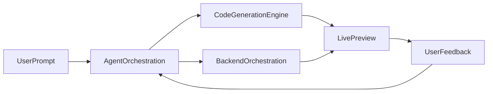
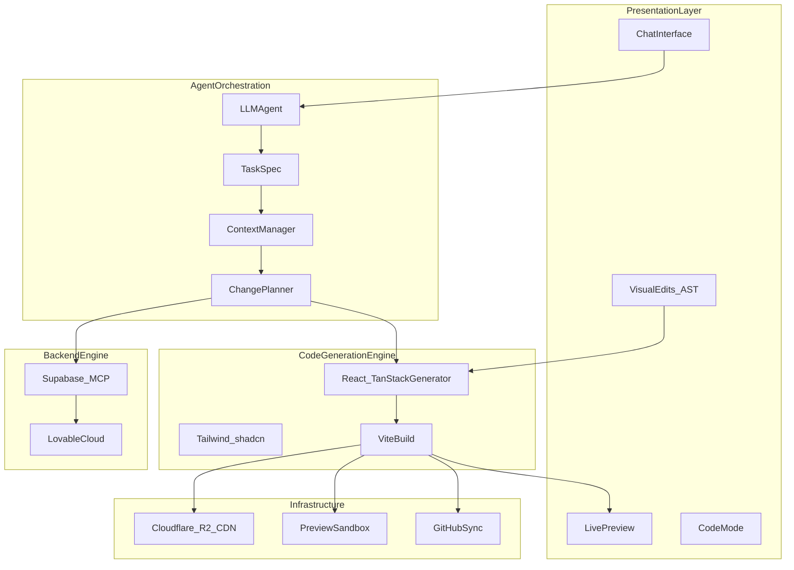
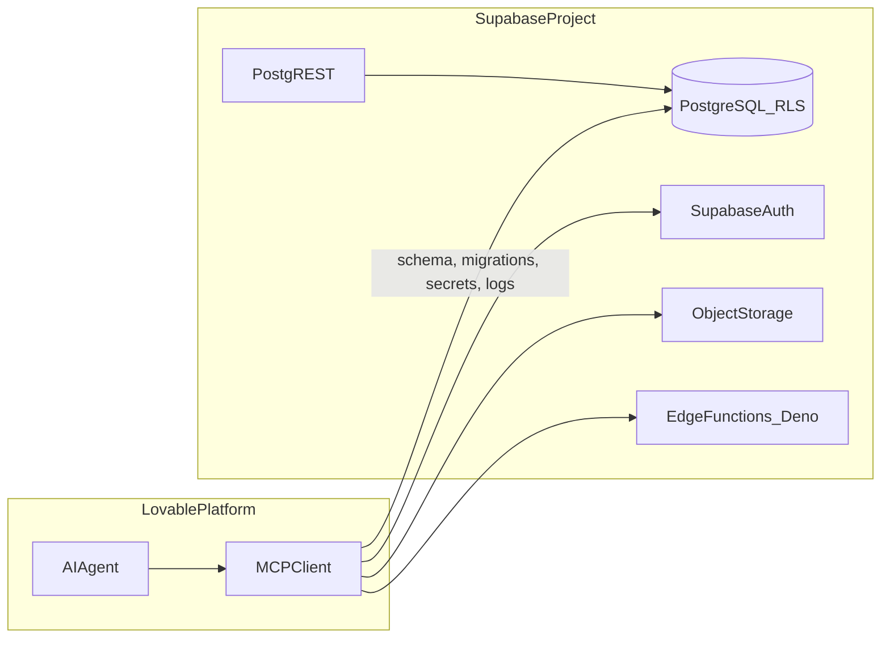
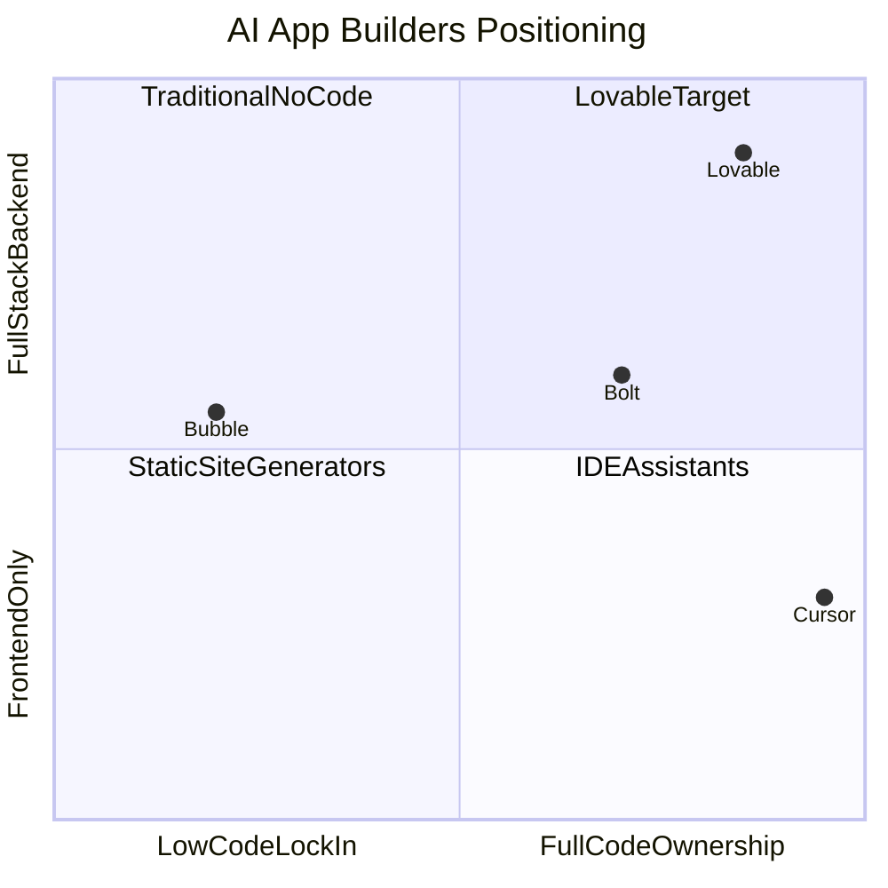

# Lovable Platform — System Design

This document is the **main architecture reference** for the Lovable.dev AI-native application platform. It describes how user intent flows through agent orchestration, code generation, backend provisioning, and deployment to produce real, exportable full-stack web applications.

**Related documentation:**

| Document | Scope |
|----------|-------|
| [Agent Loop](./agent-loop.md) | Five-step iterative orchestration cycle, context management, and change planning |
| [Reusable Blocks](./reusable-blocks.md) | Frozen scaffold blocks, activation model, block catalog, and agent boundaries |
| [Generated App Anatomy](./generated-app-anatomy.md) | Runtime architecture, security zones, deployment paths, and what every generated app contains |

**Audience note:** This repo documents the Lovable platform for **POC and prototyping**. For generated apps, the **recommended default** is free-tier hosting (Vercel Hobby + Supabase free) — see [§7 POC Hosting (Free Tier)](#7-infrastructure--devops). Full Lovable platform infrastructure is retained as reference for production-scale context.

---

## 1. Product Definition

Lovable is an **AI-native application platform** (evolved from GPT Engineer, 2023) that converts natural-language intent into **real, exportable full-stack web applications**. It is not a visual no-code builder: output is standard source code (React/TypeScript/Tailwind) that users own via GitHub export.

**Core value proposition:** collapse design → spec → build → preview into a single iterative chat loop, with managed backend primitives provisioned automatically.



---

## 2. High-Level Platform Architecture

Lovable is a **layered pipeline** from user intent to deployed application:

| Layer | Components | Responsibility |
|-------|------------|----------------|
| **Presentation** | Chat UI, live preview iframe, Code mode, Visual Edits, Plan mode | User interaction; real-time preview |
| **Agent Orchestration** | LLM agent, prompt engine, context manager, change planner | Parse intent, plan diffs, manage iteration state |
| **Code Generation** | React/TanStack generator, Tailwind/shadcn styler, TypeScript compiler, Vite build | Produce frontend routes, components, services |
| **Backend Engine** | Lovable Cloud (managed) or Supabase integration via MCP | DB schema, auth, storage, edge functions |
| **Infrastructure** | Cloudflare CDN, GCP/AWS compute, Kafka/Pub/Sub, observability stack *(Lovable platform)*; **POC apps:** Vercel Hobby + Supabase free | Hosting, scaling, analytics, CI/CD |
| **Integrations** | GitHub, Stripe, OpenAPI backends, Lovable AI Gateway | External connectivity and export |



---

## 4. Code Generation Engine

The code generation engine composes **feature code against a frozen scaffold of reusable blocks**. Cross-cutting concerns — auth, storage, routing, RLS templates — are never regenerated from scratch; the agent activates or configures blocks and generates only domain-specific pages, services, and migrations.

For the full block catalog, activation model, and agent boundary rules, see [Reusable Blocks](./reusable-blocks.md). For how the agent orchestrates generation across iterations, see [Agent Loop](./agent-loop.md).

### Default generated stack

| Concern | Technology |
|---------|------------|
| Framework | React (legacy) / TanStack Start (newer, SSR on non-Enterprise) |
| Build | Vite + HMR |
| Language | TypeScript throughout |
| Styling | Tailwind CSS |
| Components | shadcn/ui or DaisyUI (copied into repo, not opaque blocks) |
| Routing | React Router |

### Generation modes

| Mode | Description |
|------|-------------|
| **Chat mode** | Interactive multi-step reasoning, debugging, and planning |
| **Agent mode** | Autonomous exploration, proactive debugging, web search for solutions |
| **Visual Edits** | Client-side AST manipulation for inline text/color changes without full LLM regen (~40% faster UI iteration) |
| **Code mode** | Direct file editing; merges with AI-generated code (conflict risk if used bidirectionally with chat) |

### Output structure (every generated app)

```
app/
├── src/
│   ├── components/
│   ├── pages/
│   ├── services/              # Client-side API wrappers
│   └── integrations/supabase/ # Supabase client + generated types
├── supabase/
│   ├── functions/<name>/      # Deno edge functions
│   └── migrations/            # Schema + RLS + storage policies
└── [vite, tailwind, ts configs]
```

The agent **reuses** block contracts (auth provider, Supabase client, shadcn primitives, app shell, edge-fn shared utils) and **generates** domain-specific pages, components, services, migrations, and feature edge functions. See [Reusable Blocks](./reusable-blocks.md) for the complete reuse-vs-generate matrix.

---

## 5. Backend Architecture

Lovable's architectural differentiator vs. competitors: **full-stack generation**, not client-only SPAs.

### Option A: Lovable Cloud (built-in, zero-config)

- Managed Postgres, Auth, Storage, Edge Functions
- Usage-based billing (free tier ~$25/mo usage)
- Lovable AI Gateway (Gemini) for in-app LLM features
- Fastest path: one prompt → working backend

### Option B: Supabase integration (user-connected)

- User provides Supabase project URL + keys
- Lovable generates schema, auth flows, RLS policies, storage buckets
- Self-hostable path for compliance-sensitive teams

### MCP integration (critical architectural inflection)

Lovable does **not** treat Supabase as a passive REST target. Via **Model Context Protocol**, the agent gets **bidirectional, structured access**:

- Read/write database schemas and migrations
- Access logs and errors for debug loops
- Manage secrets (server-side only)
- Run Supabase CLI (Docker) for edge function deployment

This MCP layer is what enabled deep backend orchestration and reportedly drove major ARR growth — the agent can fix backend state, not just frontend API calls.



---

## 6. Generated App Runtime

Generated apps follow a **hybrid 2-tier pattern** (browser ↔ managed backend), not classic 3-tier:

| Pattern | Where logic lives |
|---------|-------------------|
| Simple CRUD | Browser → PostgREST/Storage directly; **RLS enforces authorization** |
| Secrets / external APIs / AI calls | Browser → Edge Function → external services |

**Security zones:**

- **Blue zone (client):** publishable `anon` key in bundled JS; access constrained by RLS + storage policies
- **Red zone (server):** Edge Functions hold `service_role` key, `LOVABLE_API_KEY`, third-party secrets — never exposed to browser

For runtime flows, security zone details, and example request paths (e.g. AI feature upload → edge function → gateway → RLS-scoped read), see [Generated App Anatomy](./generated-app-anatomy.md).

---

## 7. Infrastructure & DevOps

This section splits **two contexts**: the POC path for generated apps (recommended default for this repo's audience) and the production infrastructure that powers Lovable itself.

### POC / self-hosted generated app (recommended default)

For proof-of-concept work, export the generated app and deploy with **zero hosting cost**. Low latency, global CDN edge optimization, and always-warm serverless are **not** requirements — cold starts and occasional manual restores are acceptable tradeoffs.

See [Generated App Anatomy — Deployment Paths](./generated-app-anatomy.md#deployment-paths) for step-by-step env vars and `vercel.json` setup.

#### POC Hosting (Free Tier)

| Component | Service | Role |
|-----------|---------|------|
| **Frontend** | [Vercel Hobby](https://vercel.com/docs/plans/hobby) (free) | Static Vite/React SPA; SPA fallback via `vercel.json` rewrite |
| **Backend** | [Supabase free tier](https://supabase.com/pricing) | Postgres, Auth, Storage, Edge Functions (Deno) |
| **Docs site** (this repo) | VitePress on Vercel Hobby | Optional; same free static-hosting pattern |

**Minimal client env vars** (browser only — never put service-role keys in the frontend):

- `VITE_SUPABASE_URL`
- `VITE_SUPABASE_ANON_KEY`

**Accepted POC tradeoffs:**

- **Cold starts** — Supabase Edge Functions may take a few seconds to respond after inactivity; fine for demos and internal POCs
- **Project pause** — Supabase free projects pause after ~1 week of inactivity; restore manually from the Supabase dashboard
- **Vercel Hobby limits** — non-commercial use only; sufficient for POC demos
- **No edge CDN tuning** — default Vercel/Supabase routing is enough; no custom multi-region or latency SLA needed

**Explicitly not needed for POC:**

- Cloudflare R2 or custom CDN stacks
- Kafka, Pub/Sub, or event streaming
- Snowflake, BigQuery, or warehouse analytics
- Multi-cloud or dedicated compute (Fly.io, Cloud Run at scale)
- Lovable-style isolated preview sandboxes at scale

#### POC deployment paths

1. **Vercel Hobby + Supabase free** *(recommended)* — `vite build` → Vercel; connect Supabase project for backend
2. **GitHub export** — two-way sync; deploy the exported repo to Vercel Hobby; Supabase unchanged
3. **Lovable hosting** — one-click publish on the Lovable platform (paid usage; not required for POC)

### Production platform (Lovable itself)

The following describes infrastructure inferred from public sources for **Lovable.dev as a product** — not what you need to run a POC generated app.

| Category | Technologies |
|----------|-------------|
| CDN / static hosting | Cloudflare R2 + edge network (`*.lovable.app`) |
| Compute | GCP, AWS, Fly.io, Cloud Run, Modal |
| Messaging | Kafka, Pub/Sub, Kinesis |
| Analytics | Snowflake, BigQuery, ClickHouse |
| Observability | Grafana, OpenTelemetry |
| CI/CD | GitHub Actions |
| IaC | Terraform, Pulumi |

#### Lovable preview environment (platform)

- Each build produces an isolated preview artifact on Lovable infrastructure
- Hot reload during development sessions
- Version history in chat allows revert to prior working states

This is distinct from self-hosted POC deployment on Vercel + Supabase.

---

## 8. Security, Compliance & Governance

### Platform-level security

- Secrets stored in Lovable Cloud / Supabase secrets — **never in generated source**
- Client-side secret boundary enforced by architecture (not convention)
- ISO 27001:2022, SOC 2 Type II, GDPR compliance (Enterprise)
- 2FA, private project RBAC (viewer/editor)

### Generated app security model

- Auth scaffolded from first prompt (Supabase Auth + JWT)
- **RLS is the primary authorization layer** — critical because anon key is public
- Edge Functions for privileged operations

### Enterprise governance: `LOVABLE.md`

Policy-as-code manifest committed to repo:

- Defines what the AI agent may/may not modify
- Auth provider policies, secret rotation rules, export permissions
- CI/CD validates agent changes against policy on PR

Protected block paths and agent configuration boundaries are defined in [Reusable Blocks](./reusable-blocks.md).

---

## 9. Integration Layer

| Integration | Role |
|-------------|------|
| **GitHub** | Code export, version control, team handoff (no import-from-existing-repo today) |
| **Supabase** | Primary backend via MCP |
| **Stripe** | Payments |
| **Clerk** | Alternative auth |
| **OpenAPI backends** | Connect to existing REST/GraphQL APIs |
| **Lovable AI Gateway** | Centralized LLM access for generated apps |
| **MCP (future)** | Standard protocol for additional SaaS backends (Stripe, etc.) |

**Roadmap direction:** MCP as first-class integration standard — SaaS providers expose MCP servers; Lovable agents consume them directly instead of custom adapters per vendor.

---

## 10. Monetization & Scale Signals

- Usage-based pricing (credits for agent cycles + cloud usage)
- Free tier for prototyping
- Enterprise tier: governance, audit trails, policy constraints, no TanStack SSR
- Reported scale inflection tied to Supabase MCP integration (sub-$500K → $20M+ ARR trajectory)

---

## 11. Known Limitations & Design Trade-offs

| Limitation | Implication |
|------------|-------------|
| Web-only output | No native iOS/Android; responsive web only |
| No GitHub import | Greenfield projects only |
| Context window bounds | User must include relevant context each prompt |
| Prompt quality dependency | Output quality scales with task clarity |
| 2-tier + RLS model | Production requires human review of RLS policies |
| Bidirectional edit conflicts | Code mode + chat simultaneously risks drift |
| Soft vendor lock-in | Without GitHub export, project lives on platform |

---

## 12. Architectural Comparison



**Lovable's moat:** real code ownership + managed full-stack backend + MCP-orchestrated agent loop — not templates, not opaque blocks.
